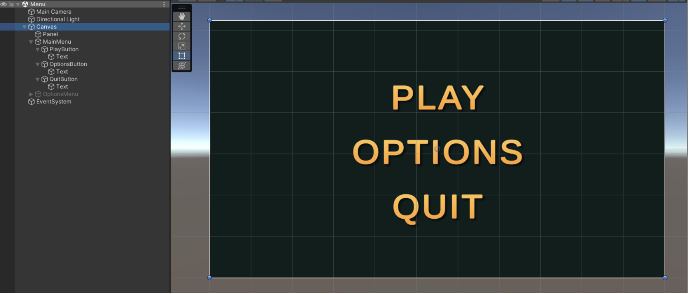
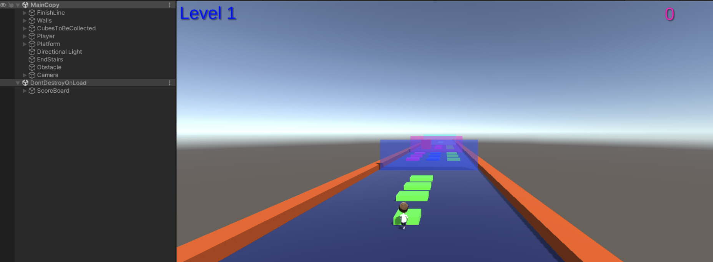
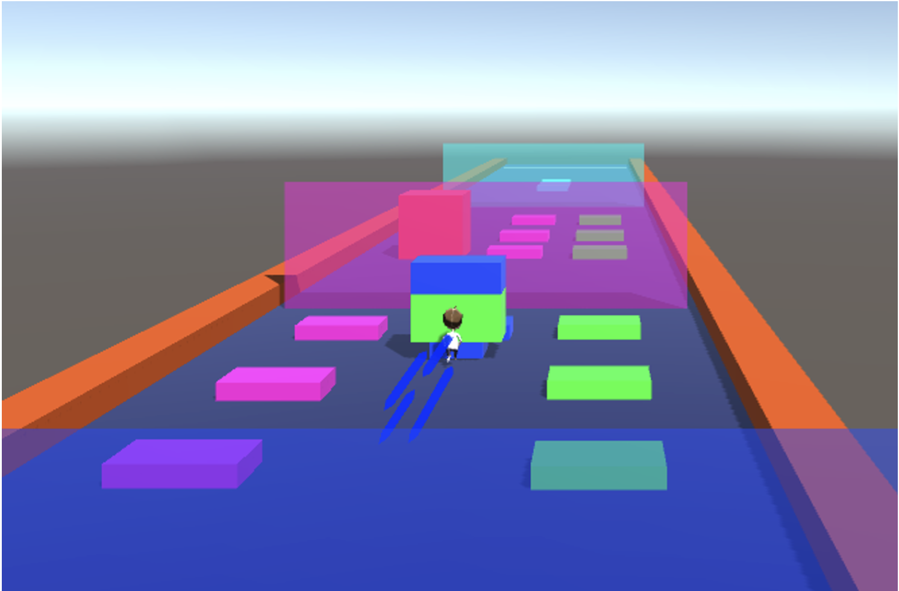
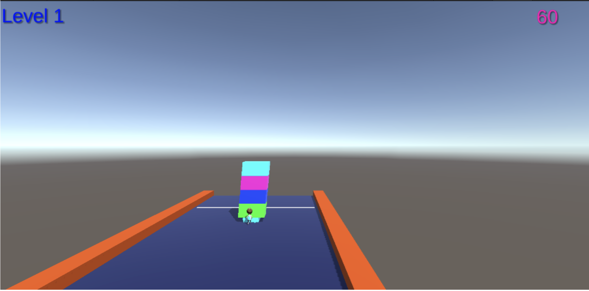
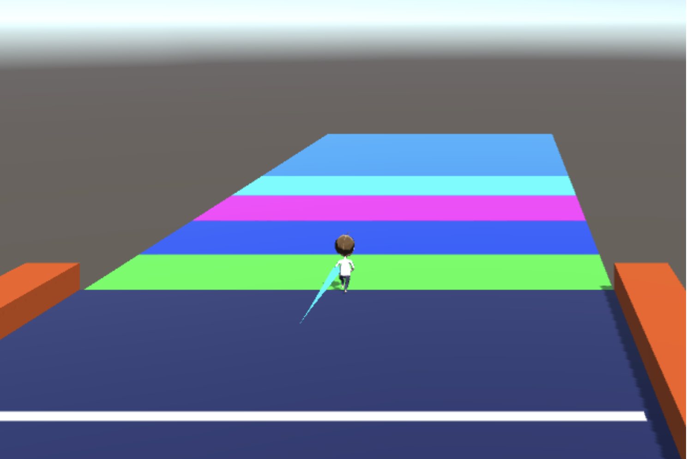

# Stack Colors Game 🎮

Hi, this is my clone for the popular Stack Colors game. This game combines simple mechanics with engaging visuals, offering a fun and rewarding gameplay experience. 

---

## Table of Contents
- [Development Details](#development-details)
- [Gameplay UI Images](#gameplay-ui-images)
- [Installation](#installation)


## Development Details

- **Game Engine**: Unity (2021.3.18f)
- **Programming Language**: C#
- **Version Control**: Plastic SCM
- **Plugins**:
  - [DoTween](http://dotween.demigiant.com/) (for animations)
  - EZ Camera Shake (for camera effects)

---

## Gameplay UI Images

Gameplay images

### Main Menu


### Level 1


### Character Trail


### Stack Swinging


### Win Area


---

## Installation

If you want to play you can clone the game from this repository.

1. Clone the repo:
   ```bash
   git clone https://github.com/yourusername/stack-colors-game.git

2. Open the project in Unity

3. Click Build and Run option (Windows / Android)
